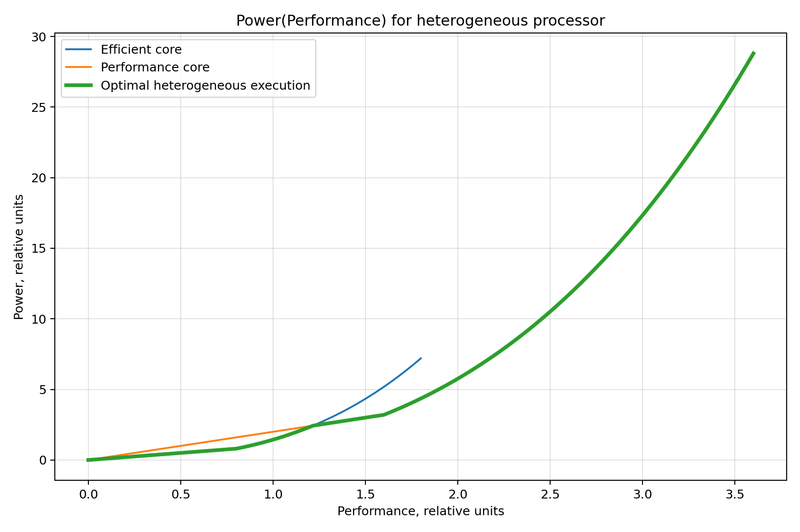
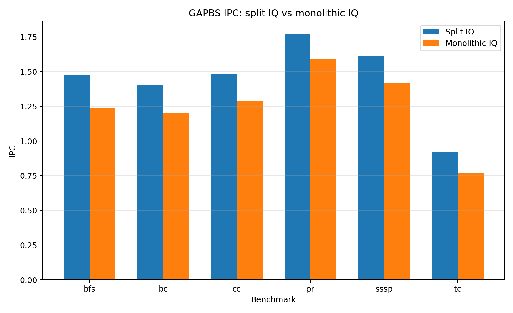

# Microarchitecture of Contemporary Microprocessors — Homework I

## Отчёт по заданиям 1, 2 и 3

---

## Файлы с результатами

- [График Power(Performance) для задания 1](report/microarch_hw_final_task1_power_performance.png)
- [CSV-таблица пайплайна для ширины 2, задание 2](report/microarch_hw_final_task2_pipeline_width2.csv)
- [CSV-таблица IPC gem5, задание 3](report/microarch_hw_final_task3_gem5_ipc_results.csv)
- [График сравнения IPC split IQ vs monolithic IQ, задание 3](report/microarch_hw_final_task3_gem5_ipc_comparison.png)

## Файлы `stats.txt` из gem5

Ниже перечислены исходные файлы статистики gem5, из которых были взяты значения IPC для таблицы в задании 3. Пути указаны относительно каталога запуска `~/hw1_3/gem5`.

### Split IQ

- [`results/split_bfs/stats.txt`](results/split_bfs/stats.txt)
- [`results/split_bc/stats.txt`](results/split_bc/stats.txt)
- [`results/split_cc/stats.txt`](results/split_cc/stats.txt)
- [`results/split_pr/stats.txt`](results/split_pr/stats.txt)
- [`results/split_sssp/stats.txt`](results/split_sssp/stats.txt)
- [`results/split_tc/stats.txt`](results/split_tc/stats.txt)

### Monolithic IQ

- [`results/mono_bfs/stats.txt`](results/mono_bfs/stats.txt)
- [`results/mono_bc/stats.txt`](results/mono_bc/stats.txt)
- [`results/mono_cc/stats.txt`](results/mono_cc/stats.txt)
- [`results/mono_pr/stats.txt`](results/mono_pr/stats.txt)
- [`results/mono_sssp/stats.txt`](results/mono_sssp/stats.txt)
- [`results/mono_tc/stats.txt`](results/mono_tc/stats.txt)

---

# 1. Гетерогенный процессор: Power(Performance)

## 1.1. Исходные данные

Рассматривается гетерогенный процессор с двумя типами ядер:

- **efficient core** — энергоэффективное ядро;
- **performance core** — производительное ядро.

По условию:

- IPC performance-ядра в 2 раза выше, чем IPC efficient-ядра;
- динамическая ёмкость `Cdyn` performance-ядра в 4 раза выше, чем у efficient-ядра;
- на изменение производительности влияет только изменение частоты;
- минимальное напряжение `Umin = 1`;
- при `f = 1` напряжение `U = 1.2`;
- при `f = 1.8` напряжение `U = 2`.

По двум точкам напряжение линейно зависит от частоты:

```text
U(f) = f + 0.2
```

С учётом минимального напряжения:

```text
U(f) = max(1, f + 0.2)
```

Диапазон частот:

```text
0 ≤ f ≤ 1.8
```

## 1.2. Производительность и мощность

За единицу производительности примем производительность efficient-ядра при `f = 1`.

Для efficient-ядра:

```text
Performance_eff = f
Power_eff(f) = U(f)^2 · f
```

Для performance-ядра IPC в 2 раза выше, а динамическая ёмкость в 4 раза выше:

```text
Performance_perf = 2f
Power_perf(f) = 4 · U(f)^2 · f
```

Для построения графика `Power(Performance)` обозначим производительность через `x`.

Для efficient-ядра:

```text
Power_eff(x) = U(x)^2 · x
```

Для performance-ядра:

```text
f = x / 2
Power_perf(x) = 4 · U(x / 2)^2 · x / 2
              = 2x · U(x / 2)^2
```

## 1.3. Оптимальная кривая

Для каждой требуемой производительности выбирается ядро с меньшей мощностью:

```text
Power_opt(x) = min(Power_eff(x), Power_perf(x))
```

Точка переключения определяется из равенства мощностей:

```text
x · (x + 0.2)^2 = 2x · (x/2 + 0.2)^2
```

После сокращения:

```text
(x + 0.2)^2 = 2 · (x/2 + 0.2)^2
```

Получается:

```text
x ≈ sqrt(2) - 0.2 ≈ 1.214
```

Следовательно:

```text
0 ≤ Performance ≲ 1.214      → выгоднее efficient core
1.214 ≲ Performance ≤ 3.6    → выгоднее performance core
```

## 1.4. График



## 1.5. Вывод по заданию 1

При малой требуемой производительности выгоднее использовать efficient-ядро, поскольку оно имеет меньшую динамическую ёмкость. При более высокой производительности выгоднее становится performance-ядро: оно достигает той же производительности на меньшей частоте и, следовательно, при меньшем напряжении.

Точка переключения между ядрами находится примерно при:

```text
Performance ≈ 1.214
```

---

# 2. Анализ RISC-V функции и диаграмма конвейера

## 2.1. Исходный код функции

```cpp
extern "C" int foo(int *a, int b) {
    int x = a[0];
    int y = a[1];
    int z = x + y + b;

    if (z & 1)
        z += a[2];
    else
        z -= a[3];

    return z + a[4];
}
```

## 2.2. Компилятор и опции

Использованный компилятор:

```text
Ubuntu clang version 14.0.0-1ubuntu1.1
Target: x86_64-pc-linux-gnu
```

Команда компиляции:

```bash
clang++ -target riscv64 -O0 -fno-omit-frame-pointer -S foo.cpp -o foo_rv64.s
```

## 2.3. Используемые входные данные

Для построения диаграммы использованы данные:

```cpp
int a[5] = {1, 2, 4, 7, 8};
int b = 0;
```

Так как `z = 1 + 2 + 0 = 3`, то `z & 1 = 1`, исполняется ветка `if`, то есть блок `.LBB0_1`.

Результат функции:

```text
z = 3 + a[2] = 3 + 4 = 7
return z + a[4] = 7 + 8 = 15
```

## 2.4. Динамически исполняемые инструкции

Для выбранных входных данных исполняется 37 динамических инструкций, включая prolog/epilog и `ret`.

Итого:

```text
37 динамических инструкций
24 обращения к памяти
1 условный переход beq
2 безусловных перехода j
1 инструкция ret
```

Требования задания выполнены: есть не менее 25 динамических инструкций, не менее 5 обращений к памяти и не менее одного условного перехода.

## 2.5. Допущения для построения диаграммы

1. Fetch занимает 1 такт.
2. Decode занимает 1 такт.
3. Инструкция после Decode попадает в Instruction Queue и может быть выдана не раньше следующего такта.
4. ALU-инструкции проходят стадии `E1`, `E2`, `WB`.
5. Load проходит стадии `E1`, `Mem`, `Mem`, `Mem`, `WB`.
6. Store проходит стадии `E1`, `Mem`, `Mem`, `Mem`, без `WB`.
7. Branch и `ret` исполняются за 1 такт на стадии `E1`.
8. Результат ALU доступен для bypassing после `E2`.
9. Результат load доступен после окончания `Mem`.
10. Issue выполняется строго in-order.
11. При stall головной инструкции младшие инструкции не выдаются.
12. Предсказатель переходов идеальный.
13. Исполнение заканчивается на стадии `E1` инструкции `ret`.

## 2.6. Диаграмма конвейера для ширины 2

Полная таблица также сохранена в файле:

[microarch_hw_final_task2_pipeline_width2.csv](report/microarch_hw_final_task2_pipeline_width2.csv)

|   # | Instruction         | Pipeline schedule, width=2   |
|----:|:--------------------|:-----------------------------|
|   1 | addi sp, sp, -48    | F1 D2 E1:3 E2:4 WB5          |
|   2 | sd ra, 40(sp)       | F1 D2 E1:5 M6-8              |
|   3 | sd s0, 32(sp)       | F3 D5 E1:6 M7-9              |
|   4 | addi s0, sp, 48     | F3 D5 E1:6 E2:7 WB8          |
|   5 | sd a0, -24(s0)      | F6 D7 E1:8 M9-11             |
|   6 | sw a1, -28(s0)      | F6 D7 E1:8 M9-11             |
|   7 | ld a0, -24(s0)      | F8 D9 E1:10 M11-13 WB14      |
|   8 | lw a0, 0(a0)        | F8 D9 E1:14 M15-17 WB18      |
|   9 | sw a0, -32(s0)      | F10 D14 E1:18 M19-21         |
|  10 | ld a0, -24(s0)      | F10 D14 E1:18 M19-21 WB22    |
|  11 | lw a0, 4(a0)        | F18 D19 E1:22 M23-25 WB26    |
|  12 | sw a0, -36(s0)      | F18 D19 E1:26 M27-29         |
|  13 | lw a0, -32(s0)      | F22 D26 E1:27 M28-30 WB31    |
|  14 | lw a1, -36(s0)      | F22 D26 E1:27 M28-30 WB31    |
|  15 | addw a0, a0, a1     | F27 D28 E1:31 E2:32 WB33     |
|  16 | lw a1, -28(s0)      | F27 D28 E1:31 M32-34 WB35    |
|  17 | addw a0, a0, a1     | F31 D32 E1:35 E2:36 WB37     |
|  18 | sw a0, -40(s0)      | F31 D32 E1:37 M38-40         |
|  19 | lbu a0, -40(s0)     | F35 D37 E1:38 M39-41 WB42    |
|  20 | andi a0, a0, 1      | F35 D37 E1:42 E2:43 WB44     |
|  21 | li a1, 0            | F38 D42 E1:43 E2:44 WB45     |
|  22 | beq a0, a1, .LBB0_2 | F38 D42 E1:45                |
|  23 | j .LBB0_1           | F43 D45 E1:46                |
|  24 | ld a0, -24(s0)      | F43 D45 E1:46 M47-49 WB50    |
|  25 | lw a1, 8(a0)        | F46 D47 E1:50 M51-53 WB54    |
|  26 | lw a0, -40(s0)      | F46 D47 E1:50 M51-53 WB54    |
|  27 | addw a0, a0, a1     | F50 D51 E1:54 E2:55 WB56     |
|  28 | sw a0, -40(s0)      | F50 D51 E1:56 M57-59         |
|  29 | j .LBB0_3           | F54 D56 E1:57                |
|  30 | lw a0, -40(s0)      | F54 D56 E1:57 M58-60 WB61    |
|  31 | ld a1, -24(s0)      | F57 D58 E1:59 M60-62 WB63    |
|  32 | lw a1, 16(a1)       | F57 D58 E1:63 M64-66 WB67    |
|  33 | addw a0, a0, a1     | F59 D63 E1:67 E2:68 WB69     |
|  34 | ld ra, 40(sp)       | F59 D63 E1:67 M68-70 WB71    |
|  35 | ld s0, 32(sp)       | F67 D68 E1:69 M70-72 WB73    |
|  36 | addi sp, sp, 48     | F67 D68 E1:69 E2:70 WB71     |
|  37 | ret                 | F69 D70 E1:71                |

Итог:

```text
Количество динамических инструкций = 37
Количество тактов = 71
IPC = 37 / 71 ≈ 0.521
```

## 2.7. Увеличение ширины до 4

Для варианта с шириной 4 изменяются параметры:

- ширина fetch/decode/issue увеличивается с 2 до 4;
- ёмкость Instruction Queue увеличивается с 2 до 4;
- число integer pipeline увеличивается с 2 до 4;
- остальные параметры остаются прежними.

Для той же последовательности инструкций получено:

```text
Количество динамических инструкций = 37
Количество тактов = 64
IPC = 37 / 64 ≈ 0.578
```

Прирост производительности:

```text
Speedup = 71 / 64 ≈ 1.109
```

То есть ускорение:

```text
≈ 10.9%
```

## 2.8. Вывод по заданию 2

Увеличение ширины исполнения с 2 до 4 даёт сравнительно небольшой прирост. Основная причина — код, скомпилированный с `-O0`, содержит много обращений к стеку и зависимых инструкций через регистр `a0`. Из-за строгого in-order issue инструкция в голове очереди может блокировать выдачу всех младших инструкций.

---

# 3. gem5: split IQ против monolithic IQ для Neoverse V2

## 3.1. Конфигурация эксперимента

Использовался симулятор:

```text
gem5 version 25.1.0.1
```

Модель процессора:

```text
Neoverse V2
```

Режим симуляции:

```text
SE mode
```

Бенчмарки:

```text
GAPBS: bfs, bc, cc, pr, sssp, tc
```

Сборка GAPBS выполнялась под ARM:

```bash
make CXX=aarch64-linux-gnu-g++ \
     CXX_FLAGS="-std=c++11 -O1 -Wall -static" \
     SERIAL=1
```

Использовался входной граф:

```text
Kronecker graph, scale = 10
```

## 3.2. Модификация IQ

В исходной модели Neoverse V2 используются 9 разделённых IQ:

```text
IQ0 = 22
IQ1 = 22
IQ2 = 22
IQ3 = 22
IQ4 = 28
IQ5 = 28
IQ6 = 16
IQ7 = 16
IQ8 = 16
```

Суммарный размер:

```text
22 + 22 + 22 + 22 + 28 + 28 + 16 + 16 + 16 = 192
```

В модифицированной модели была реализована одна монолитная IQ:

```text
Monolithic IQ = 192 entries
```

Функциональные устройства были объединены в общий FU pool так, чтобы сохранить суммарное количество устройств исходной модели:

```text
Simple Int: 4
Complex Int: 2
FP/Vector: 4
Load: 3
Store: 2
```

## 3.3. Команды запуска

Пример запуска для split IQ:

```bash
cp configs/common/cores/arm/neoverse_v2_split.py \
   configs/common/cores/arm/neoverse_v2.py

build/ARM/gem5.opt \
    --outdir=results/split_pr \
    configs/example/arm/gapbs_neoverse_v2.py \
    --cmd=/home/varvara_los/hw1_3/gapbs/pr \
    --options="-g 10"
```

Пример запуска для monolithic IQ:

```bash
cp configs/common/cores/arm/neoverse_v2_mono.py \
   configs/common/cores/arm/neoverse_v2.py

build/ARM/gem5.opt \
    --outdir=results/mono_pr \
    configs/example/arm/gapbs_neoverse_v2.py \
    --cmd=/home/varvara_los/hw1_3/gapbs/pr \
    --options="-g 10"
```

## 3.4. Результаты IPC

Результаты также сохранены в файле:

[microarch_hw_final_task3_gem5_ipc_results.csv](report/microarch_hw_final_task3_gem5_ipc_results.csv)

| Benchmark   |   IPC split IQ |   IPC monolithic IQ |   Change, % |
|:------------|---------------:|--------------------:|------------:|
| bfs         |       1.47371  |            1.23952  |      -15.89 |
| bc          |       1.40382  |            1.20448  |      -14.2  |
| cc          |       1.48021  |            1.29265  |      -12.67 |
| pr          |       1.77446  |            1.5884   |      -10.49 |
| sssp        |       1.61278  |            1.41816  |      -12.07 |
| tc          |       0.917262 |            0.767095 |      -16.37 |

Среднее изменение IPC:

```text
(-15.89 - 14.20 - 12.67 - 10.49 - 12.07 - 16.37) / 6 ≈ -13.62%
```

График сравнения:



## 3.5. Объяснение результата

Переход к монолитной IQ ухудшил IPC на всех рассмотренных бенчмарках. Среднее снижение IPC составило примерно 13.6%.

Хотя монолитная IQ устраняет фрагментацию свободных записей между отдельными очередями, она также меняет механизм конкуренции инструкций за выбор из IQ и за функциональные устройства. В исходной модели Neoverse V2 инструкции разных типов распределяются по специализированным очередям: simple integer, complex integer, FP/vector, load и load/store. Такая организация позволяет независимо выбирать инструкции из разных execution domains и уменьшает конкуренцию между различными типами операций.

В монолитной IQ все инструкции находятся в одной общей очереди. В результате инструкции разных классов сильнее конкурируют друг с другом за выбор и issue. Для GAPBS характерны нерегулярные обращения к памяти, зависимые загрузки и ограниченный memory-level parallelism. Поэтому потеря специализации очередей оказывается важнее, чем выигрыш от устранения фрагментации свободных записей.

## 3.6. Вывод по заданию 3

В данном эксперименте исходная организация с девятью разделёнными IQ показала более высокий IPC, чем монолитная IQ. Простое объединение очередей и увеличение общей гибкости планирования не гарантирует повышения производительности. Для данной модели Neoverse V2 и набора GAPBS-бенчмарков специализированные разделённые очереди оказались эффективнее.

---

# Общий вывод

В задании 1 показано, что оптимальный выбор ядра в гетерогенном процессоре зависит от требуемой производительности: при малых значениях выгоднее efficient-ядро, а после точки около `Performance ≈ 1.214` — performance-ядро.

В задании 2 построена диаграмма исполнения RISC-V функции на in-order суперскалярном процессоре. Увеличение ширины с 2 до 4 дало ускорение около 10.9%, поскольку производительность ограничивалась зависимостями и обращениями к памяти.

В задании 3 эксперимент в gem5 показал, что переход от 9 разделённых IQ к одной монолитной IQ размером 192 entries снизил IPC в среднем примерно на 13.6%. Это объясняется потерей специализации очередей и ростом конкуренции между инструкциями разных типов.
