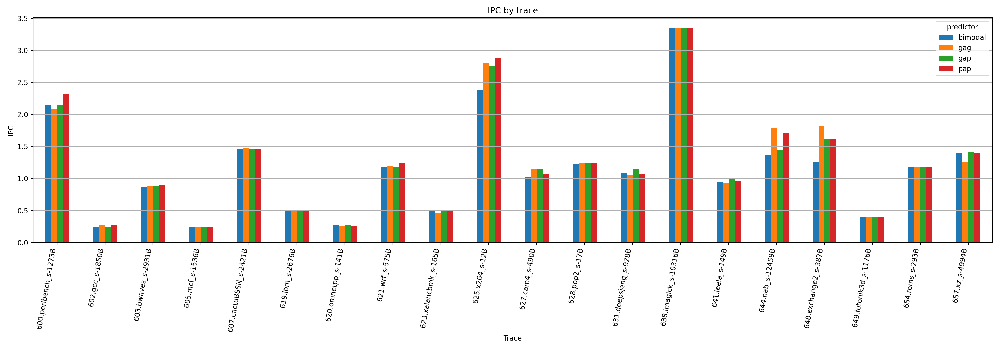
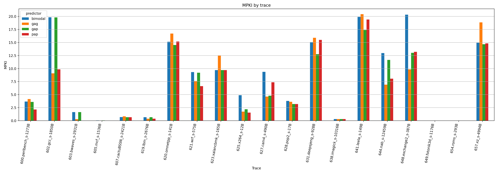

# HW 2: Сравнение branch predictors в ChampSim

## Цель работы

Цель работы — реализовать и сравнить схемы предсказания переходов **PAp**, **GAg** и **GAp** с базовым **bimodal**-предиктором в симуляторе ChampSim. Сравнение выполнялось на наборе трасс SPEC CPU 2017 из DPC-3 при одинаковой базовой конфигурации симулятора.

## Конфигурация эксперимента

Использовался исходный JSON-конфиг ChampSim с изменённым штрафом за неверное предсказание перехода:

```json
"mispredict_penalty": 12
```

Во всех экспериментах остальные параметры конфигурации не изменялись. Менялся только параметр:

```json
"branch_predictor": "<predictor>"
```

Рассматривались четыре варианта:

- `bimodal`
- `gag`
- `gap`
- `pap`

## Реализованные предикторы

### Bimodal

Базовый предиктор ChampSim. Использует таблицу 2-битных saturating counters, индексируемую по адресу инструкции перехода.

### GAg

Схема **GAg** использует один глобальный регистр истории переходов и одну глобальную Pattern History Table. Индексация PHT выполняется по глобальной истории.

### GAp

Схема **GAp** использует один глобальный регистр истории, но несколько PHT-банков, выбираемых по адресу инструкции перехода. Это уменьшает aliasing по сравнению с GAg.

### PAp

Схема **PAp** использует локальную историю для разных ветвлений и отдельные PHT-банки, выбираемые по адресу инструкции перехода. Такой предиктор лучше улавливает локальные повторяющиеся шаблоны конкретных ветвей.

## Размеры предикторов

Для честного сравнения размеры структур были выбраны близкими.

| Предиктор | Конфигурация | Оценка размера |
|---|---|---:|
| bimodal | 16384 2-битных счётчиков | 32768 bit |
| GAg | 14-bit global history + 16384 2-битных счётчиков | ≈ 32782 bit |
| GAp | 4-bit global history + 1024 банков × 16 2-битных счётчиков | ≈ 32772 bit |
| PAp | 1024 local histories × 4 bit + 1024 банков × 16 2-битных счётчиков | ≈ 36864 bit |

## Использованные трассы

В эксперименте использовались следующие трассы SPEC CPU 2017 из DPC-3:

- `600.perlbench_s-1273B.champsimtrace.xz`
- `602.gcc_s-1850B.champsimtrace.xz`
- `603.bwaves_s-2931B.champsimtrace.xz`
- `605.mcf_s-1536B.champsimtrace.xz`
- `607.cactuBSSN_s-2421B.champsimtrace.xz`
- `619.lbm_s-2676B.champsimtrace.xz`
- `620.omnetpp_s-141B.champsimtrace.xz`
- `621.wrf_s-575B.champsimtrace.xz`
- `623.xalancbmk_s-165B.champsimtrace.xz`
- `625.x264_s-12B.champsimtrace.xz`
- `627.cam4_s-490B.champsimtrace.xz`
- `628.pop2_s-17B.champsimtrace.xz`
- `631.deepsjeng_s-928B.champsimtrace.xz`
- `638.imagick_s-10316B.champsimtrace.xz`
- `641.leela_s-149B.champsimtrace.xz`
- `644.nab_s-12459B.champsimtrace.xz`
- `648.exchange2_s-387B.champsimtrace.xz`
- `649.fotonik3d_s-1176B.champsimtrace.xz`
- `654.roms_s-293B.champsimtrace.xz`
- `657.xz_s-4994B.champsimtrace.xz`

## Результаты

Полные результаты по всем трассам находятся в файле:

```text
measurements/hw2_results.csv
```

Сводная таблица с GMEAN находится в файле:

```text
measurements/hw2_summary_computed.csv
```

### Сводная таблица

| Предиктор | IPC GMEAN | MPKI GMEAN | Средняя accuracy | IPC vs bimodal | MPKI reduction vs bimodal |
| --- | ---: | ---: | ---: | ---: | ---: |
| bimodal | 0.9068 | 2.3345 | 92.90% | +0.00% | 0.00% |
| gag | 0.9453 | 1.7863 | 94.78% | +4.24% | 23.48% |
| gap | 0.9405 | 2.0525 | 93.93% | +3.71% | 12.08% |
| pap | 0.9532 | 1.3229 | 95.21% | +5.11% | 43.33% |


### IPC по трассам



### MPKI по трассам



## Анализ результатов

По геометрическому среднему IPC все схемы с историей превосходят bimodal. Наилучший результат показал **PAp**: IPC GMEAN увеличился примерно на **5.11%**, а MPKI GMEAN снизился примерно на **43.33%** относительно bimodal.

**GAg** также заметно улучшает качество предсказаний: MPKI GMEAN снижается примерно на **23.48%** относительно bimodal. Это объясняется тем, что глобальная история позволяет учитывать корреляции между разными ветвлениями.

**GAp** оказался лучше bimodal по IPC и MPKI, но слабее GAg и PAp в данной конфигурации. Вероятная причина — выбранная длина истории и разбиение PHT уменьшают aliasing, но не всегда достаточно хорошо захватывают полезные локальные паттерны.

Результаты в целом соответствуют ожиданиям:

- **bimodal** не использует историю и хорошо работает только для ветвей с устойчивым bias;
- **GAg** использует глобальную историю и может находить корреляции между разными ветвлениями, но страдает от aliasing в общей PHT;
- **GAp** уменьшает aliasing за счёт разбиения таблиц по адресу перехода;
- **PAp** лучше всего захватывает локальные паттерны отдельных ветвлений и поэтому показывает лучший средний результат на данном наборе трасс.

## Вывод

В ходе работы были реализованы предикторы **GAg**, **GAp** и **PAp** и сравнены с базовым **bimodal**-предиктором ChampSim. На выбранном наборе трасс SPEC CPU 2017 все предикторы с использованием истории показали улучшение относительно bimodal. Лучшим по совокупности метрик оказался **PAp**, который дал наибольшее снижение MPKI и наибольшее увеличение IPC GMEAN.

## Состав архива/папки для сдачи

Рекомендуемая структура папки для сдачи:

```text
hw2_report/
├── README.md
├── measurements/
│   ├── hw2_results.csv
│   └── hw2_summary_computed.csv
├── figures/
│   ├── ipc_by_trace.png
│   └── mpki_by_trace.png
├── configs/
│   ├── config_bimodal.json
│   ├── config_gag.json
│   ├── config_gap.json
│   └── config_pap.json
├── predictors/
│   ├── gag/
│   ├── gap/
│   └── pap/
└── scripts/
    ├── run_all.sh
    ├── parse_results.py
    └── plot_results.py
```
