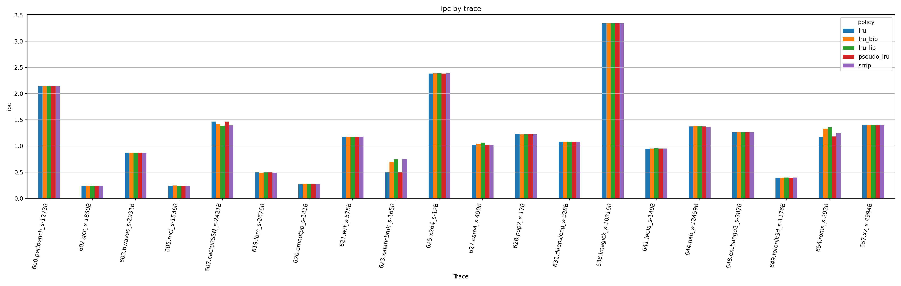
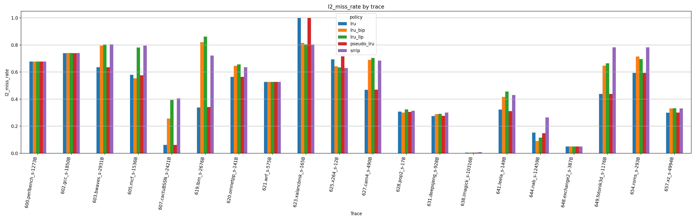

# HW 3: Политики замещения и вставки для L2-кэша в ChampSim

## Цель работы

Цель работы — реализовать и сравнить политики замещения и вставки для L2-кэша в симуляторе ChampSim на том же наборе трасс SPEC CPU 2017, который использовался во втором задании.

Сравнивались политики:

- LRU;
- Pseudo-LRU;
- SRRIP;
- LRU+LIP;
- LRU+BIP при ε = 1/32.

Метрики:

- IPC;
- miss rate для L2-кэша;
- GMEAN по всему набору трасс.

## Конфигурация эксперимента

Использовался тот же симулятор ChampSim и тот же набор трасс, что и в HW2.

Во всех экспериментах branch predictor был одинаковым:

```json
"branch_predictor": "bimodal"
```

Штраф за неверное предсказание перехода:

```json
"mispredict_penalty": 12
```

Изменялась только политика replacement для L2-кэша:

```json
"L2C": {
  "replacement": "<policy>"
}
```

Политика замещения LLC оставалась `lru`.

## Реализованные политики

### LRU

LRU использует точный порядок последнего обращения к линиям кэша. При вытеснении выбирается линия, к которой дольше всего не обращались.

### Pseudo-LRU

Pseudo-LRU реализована как tree-based PLRU. Для 8-way L2-кэша на каждый set хранится 7 битов дерева. При обращении к way обновляются биты на пути от корня к листу. При выборе victim выполняется обход дерева по битам, указывающим менее недавно использованное поддерево.

Pseudo-LRU дешевле точного LRU в аппаратной реализации, но может выбирать не строго самую старую линию.

### SRRIP

SRRIP использует RRPV-счётчики. При попадании RRPV устанавливается в 0, а при вставке новая линия получает RRPV = maxRRPV - 1. В качестве victim выбирается линия с максимальным RRPV.

### LRU+LIP

LIP — LRU Insertion Policy. На cache hit политика ведёт себя как обычный LRU. При вставке новая линия помещается в LRU-позицию, а не в MRU-позицию. Это уменьшает загрязнение кэша потоковыми данными с низкой повторной используемостью.

### LRU+BIP

BIP — Bimodal Insertion Policy. Почти всегда новая линия вставляется как в LIP, то есть в LRU-позицию. С вероятностью ε = 1/32 линия вставляется как MRU. Такая политика сохраняет защиту от загрязнения кэша, но иногда позволяет новым данным остаться в кэше при наличии повторного использования.

## Использованные трассы

Использовались 20 трасс SPEC CPU 2017 из DPC-3:

- `600.perlbench_s-1273B.champsimtrace.xz`
- `602.gcc_s-1850B.champsimtrace.xz`
- `603.bwaves_s-2931B.champsimtrace.xz`
- `605.mcf_s-1536B.champsimtrace.xz`
- `607.cactuBSSN_s-2421B.champsimtrace.xz`
- `619.lbm_s-2676B.champsimtrace.xz`
- `620.omnetpp_s-141B.champsimtrace.xz`
- `621.wrf_s-575B.champsimtrace.xz`
- `623.xalancbmk_s-165B.champsimtrace.xz`
- `625.x264_s-12B.champsimtrace.xz`
- `627.cam4_s-490B.champsimtrace.xz`
- `628.pop2_s-17B.champsimtrace.xz`
- `631.deepsjeng_s-928B.champsimtrace.xz`
- `638.imagick_s-10316B.champsimtrace.xz`
- `641.leela_s-149B.champsimtrace.xz`
- `644.nab_s-12459B.champsimtrace.xz`
- `648.exchange2_s-387B.champsimtrace.xz`
- `649.fotonik3d_s-1176B.champsimtrace.xz`
- `654.roms_s-293B.champsimtrace.xz`
- `657.xz_s-4994B.champsimtrace.xz`

Всего было выполнено 100 запусков:

```text
5 policies × 20 traces = 100 runs
```

## Результаты

Полные результаты по всем трассам находятся в файле:

```text
measurements/hw3_results.csv
```

Сводная таблица с GMEAN находится в файле:

```text
measurements/hw3_summary_computed.csv
```

### Сводная таблица

| Policy | IPC GMEAN | L2 miss rate GMEAN | IPC vs LRU | L2 miss rate reduction vs LRU |
|---|---:|---:|---:|---:|
| LRU | 0.9068 | 0.2961 | +0.00% | +0.00% |
| Pseudo-LRU | 0.9067 | 0.2961 | -0.01% | +0.00% |
| SRRIP | 0.9247 | 0.3965 | +1.97% | -33.89% |
| LRU+LIP | 0.9325 | 0.3696 | +2.83% | -24.81% |
| LRU+BIP | 0.9275 | 0.3472 | +2.28% | -17.26% |

### IPC по трассам



### L2 miss rate по трассам



## Анализ результатов

Pseudo-LRU показал практически такое же поведение, как LRU. IPC GMEAN отличается менее чем на 0.02%, а L2 miss rate GMEAN почти совпадает с LRU. Это ожидаемый результат: для 8-way L2-кэша tree-based Pseudo-LRU достаточно хорошо аппроксимирует точный LRU, хотя аппаратно требует меньше состояния и более простой логики обновления.

SRRIP улучшил IPC GMEAN примерно на 1.97% относительно LRU, однако L2 miss rate GMEAN оказался выше. Это означает, что общий miss rate не всегда напрямую определяет IPC. Важны не только количество L2-промахов, но и то, какие именно промахи находятся на критическом пути исполнения, насколько они перекрываются с другими обращениями к памяти и как политика влияет на сохранение полезных блоков.

LRU+BIP улучшил IPC GMEAN примерно на 2.28% относительно LRU. При этом L2 miss rate GMEAN увеличился. BIP вставляет большинство новых линий в LRU-позицию, поэтому потоковые данные с низкой повторной используемостью быстрее вытесняются и меньше загрязняют кэш. Редкая MRU-вставка с ε = 1/32 позволяет политике не быть слишком агрессивной и сохранять часть новых блоков, которые могут использоваться повторно.

LRU+LIP показал лучший IPC GMEAN среди рассмотренных вариантов: примерно +2.83% относительно LRU. Это говорит о том, что на данном наборе трасс агрессивная вставка новых линий в LRU-позицию оказалась полезной для производительности. Вероятная причина — наличие потоковых обращений или данных с низкой повторной используемостью, которые при обычном LRU могли вытеснять более полезные старые блоки.

При этом LRU+LIP и LRU+BIP не уменьшили агрегированный L2 miss rate. Следовательно, в данном эксперименте изменение политики вставки помогло улучшить производительность, но не снизило среднее число L2-промахов. Это показывает, что miss rate является важной, но не единственной метрикой: разные промахи могут иметь разную стоимость для IPC.

## Когда LIP/BIP помогают уменьшить загрязнение кэша

Политики LIP и BIP помогают в случаях, когда в программе есть потоковые обращения к данным или большое количество блоков с низкой повторной используемостью. При обычном LRU каждая новая линия вставляется как MRU и может вытеснить полезные данные, которые ещё будут использоваться. Это приводит к загрязнению кэша.

LIP решает эту проблему тем, что вставляет новую линию сразу в LRU-позицию. Если линия больше не используется, она быстро вытесняется и не мешает полезным данным. BIP действует похожим образом, но иногда вставляет линию как MRU, что помогает не потерять производительность на данных с некоторым повторным использованием.

В данном наборе трасс LIP/BIP улучшили IPC, но по GMEAN не уменьшили L2 miss rate. Поэтому можно сделать вывод, что они помогли с точки зрения производительности и критичности промахов, но не дали улучшения по агрегированной характеристике miss rate.

## Вывод

В ходе работы были реализованы Pseudo-LRU, LRU+LIP и LRU+BIP для L2-кэша ChampSim и проведено сравнение с LRU и SRRIP. Pseudo-LRU практически повторил поведение LRU. Лучший IPC GMEAN показала политика LRU+LIP, затем LRU+BIP и SRRIP. При этом все три политики улучшили IPC относительно LRU, но показали больший L2 miss rate GMEAN. Это подтверждает, что итоговая производительность зависит не только от общего miss rate, но и от характера промахов и их влияния на критический путь исполнения.

## Состав папки для сдачи

```text
hw3_report/
├── README.md
├── measurements/
│   ├── hw3_results.csv
│   ├── hw3_summary.csv
│   └── hw3_summary_computed.csv
├── figures/
│   ├── hw3_ipc_by_trace.png
│   └── hw3_l2_miss_rate_by_trace.png
├── configs/
│   ├── config_hw3_lru.json
│   ├── config_hw3_pseudo_lru.json
│   ├── config_hw3_srrip.json
│   ├── config_hw3_lru_lip.json
│   └── config_hw3_lru_bip.json
├── replacement/
│   ├── pseudo_lru/
│   ├── lru_lip/
│   └── lru_bip/
├── scripts/
│   ├── run_hw3_all.sh
│   ├── parse_hw3_results.py
│   ├── plot_hw3_results.py
│   └── compare_hw3.py
└── raw_results/
    └── *.out
```
